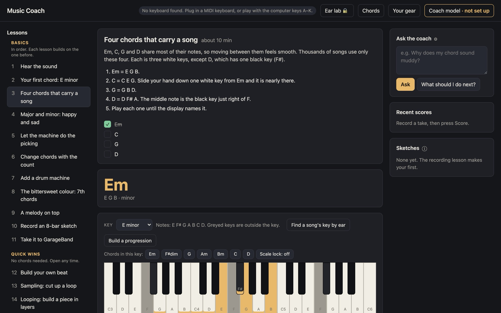

# Music Coach

[](https://github.com/stylusnexus/music-coach/actions/workflows/test.yml)
[](LICENSE)


Learn to make music on your Mac, and learn GarageBand while you do it.

Guided lessons take you from your first chord to a finished track. You play
chords, beats and loops in a practice room that sounds good from the first
note, then take what you made into GarageBand and learn its tools step by
step, with screenshots: tracks, the grid, the Piano Roll, mixing, fades and
exporting. You don't need to play an instrument: a small MIDI keyboard helps,
and your computer keys work too.



It runs on your Mac and opens in Chrome. Nothing is uploaded, and there's no
account.

## Why this exists

I built Music Coach because I was lost. I had GarageBand, a small keyboard and
plenty of plugins, but no sense of how it all fits together, and not much
patience for learning each tool from its manual. I wanted to make something
first and understand it along the way. If that sounds like you, this is for
you.

— Eve, Stylus Nexus

## What's inside

- **30 short lessons in four sections.**
  - **Basics:** your first chord, four chords that carry a song, major and
    minor, letting an arpeggiator do the picking, a drum machine, 7th chords,
    recording a sketch, and taking it to GarageBand.
  - **Quick wins:** build a beat, cut up a loop in the sampler, build a piece
    in layers with the looper.
  - **GarageBand skills:** the map, drag and drop, the grid, the Piano Roll,
    multi-tracking, blending, fades, exporting. Each step has a screenshot.
  - **Styles:** kosmische, Eno-style ambient, dark ambient, Stereolab, new
    wave, post-punk and darkwave, shoegaze.
- **A studio:** sounds, effects, arpeggiator, drum patterns and your own beat
  grid, bass and drone layers, a looper, a sampler (it can record a sound from
  your microphone and chop it up), a mixer, and a progression builder.
- **Hear the real thing:** each style links one real record, played from the
  artist's or label's Bandcamp page when you press Hear it.
- **Chords and keys:** a chord explorer, a circle-of-fifths wheel, a key
  picker with scale lock, and a way to find a song's key by ear.
- **Ear lab:** short ear-training drills that unlock as you go.
- **A take coach:** record a take and it scores chords, timing, feel, sound and
  ending from what it measured. It can't hear you; it only scores the numbers.
- **Your gear:** it finds the plugins on your Mac. You can add sample folders
  and hardware, or remove anything. Lessons name your own gear when you have
  it, and GarageBand's built-in effects when you don't.

## What you need

- A Mac with **GarageBand** (free from Apple).
- **Google Chrome.** Safari can't read MIDI keyboards.
- **Python 3.9 or newer.** The app tells you where to get it if it's missing.
- A small MIDI keyboard is nice but optional: computer keys A–K play white
  notes, W E T Y U the black ones, and Z to , the octave below.

## Start

**The app:** build `Music Coach.zip` (see [Build the app](#build-the-app));
a download under Releases is coming. Unzip it, then right-click **Music
Coach** and choose **Open** (it isn't notarized yet, so the first open needs
the right-click). It starts the coach and opens Chrome.

**From source:**

```sh
git clone https://github.com/stylusnexus/music-coach.git
cd music-coach
./music-coach
```

This starts the local server and opens http://localhost:8765 in Chrome.

To start it with a double-click next time, make a shortcut:

```sh
./music-coach shortcut
```

This puts a **Music Coach** app on your Desktop that starts this copy (add a
folder to put it elsewhere, e.g. `./music-coach shortcut ~/Applications`).

The first time, a welcome screen asks what gear you have. Skip it if you have
none: every lesson works with the app's own sounds and GarageBand's.

## The coach model (bring your own key)

The coach model answers your questions ("why does my chord sound muddy?") and
writes a short summary under a take's scores. Press **Coach model** at the top
of the app to pick one:

- **A model on your Mac**, in [LM Studio](https://lmstudio.ai): load a model,
  open the Developer tab, and switch the server on. Free, and nothing leaves
  your Mac.
- **OpenAI or Anthropic**: paste your own API key. The defaults are small, cheap
  models (gpt-5-nano, Claude Haiku 4.5), well under a cent per question.
- **Another service that works like OpenAI's**, such as Ollama or OpenRouter:
  its address, the model name, and a key if it needs one.

Your key is saved only on your Mac, readable by your account only, and sent
only to the service you picked. Without any model, the lessons, the studio
and the take scores all still work. Only the written summary and the Ask box
need one.

## Why doesn't my guitar sound like a real guitar?

In the practice room, it isn't one. To stay small, free and quick to start, the app plays stand-in sounds: a plucked-string model for the guitar, and simple synth tones for bass, strings and organ. They're there so you can hear chords and rhythm while you learn, not to sound like the record.

To get the real sound:

1. **In GarageBand (free):** open your sketch, select the track, and pick a real instrument from the Library (press Y). GarageBand has acoustic and electric guitars, pianos and strings. For more, choose GarageBand > Sound Library > Download All Available Sounds.
2. **Plugins you own:** instrument plugins, like a guitar player or piano library, go on a GarageBand track the same way. The Your gear window lists what you have.
3. **After you download GarageBand's full Sound Library,** the practice room's guitar switches to a recorded 12-string automatically: it uses one of those sounds.

## Privacy

Everything runs on your Mac. Your progress, gear list, sketches and key stay
in local files. The app goes online only in two cases:

- when you pick an online coach model, and then only to that service;
- when you press **Hear it** on a style, which loads that track's player from
  Bandcamp. Bandcamp, and the analytics its player uses, see that visit.
  Nothing loads until you press it.

## Where things live

When you run from source:

- `sketches/`: your saved MIDI sketches.
- `data/progress.json`: which lessons you've finished.
- `data/gear.json`: your sample folders, gear added by hand, gear you removed.
- `data/coach.json`: which coach model answers, and your API key.

The packaged app keeps these in `~/Library/Application Support/Music Coach`,
and sketches in `~/Music/Music Coach Sketches`. The two copies don't share
progress, so pick one.

## Build the app

```sh
packaging/build.sh
```

Builds `dist/Music Coach.zip`. Only the app goes in: never your data, sketches
or key.

## Develop

No dependencies and no build step: the Python standard library for the
server, plain browser JavaScript for the app, Node's built-in test runner for
the music logic.

```sh
npm test
```

- `server.py`: serves the app, stores progress and gear, scans plugins, talks
  to the coach model.
- `web/lessons.js`: lesson content. Add a lesson by adding an entry here.
- `web/app.js`: the page. `web/audio.js`: the sound engine. `web/music.js`:
  chords, keys and MIDI files.

## What's next

More styles are planned, and each person picks up to 5 to show: house, dub and
reggae, lo-fi hip-hop, downtempo, Afrobeat, punk, folk, ambient drone, ambient
techno and more. Every starter style has to work on a Mac with nothing extra
installed. Also planned: Logic Pro and Ableton Live lessons, phone and tablet
layouts, and Windows. See [the issues](https://github.com/stylusnexus/music-coach/issues).

Mac only for now.

## Contributing

See [CONTRIBUTING.md](CONTRIBUTING.md). Changes are listed in [CHANGELOG.md](CHANGELOG.md).

## License

MIT. See [LICENSE](LICENSE).
